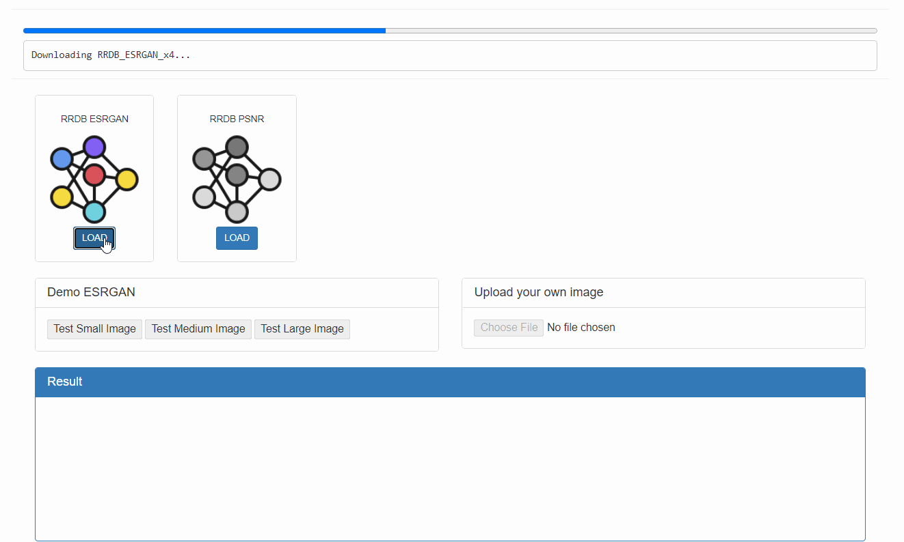
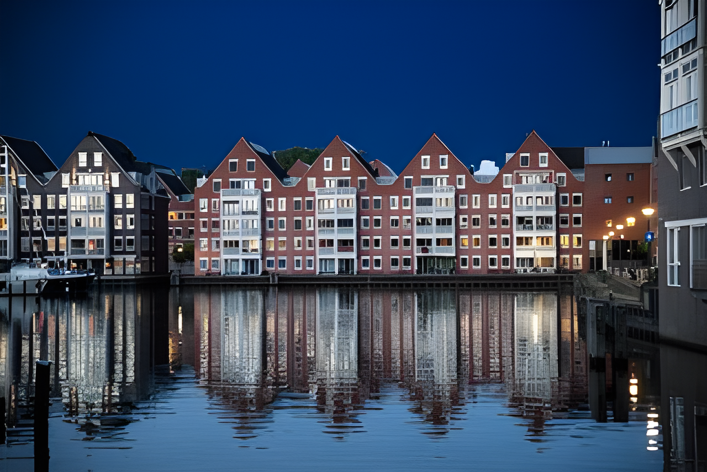
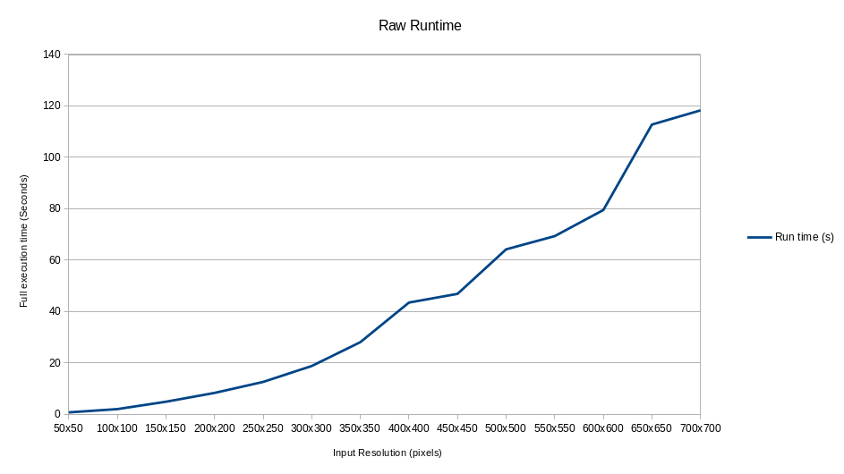

WebGPU Image Super Resolution
======================

**University of Pennsylvania, CIS 565: GPU Programming and Architecture, Final Proejct**

* Paul (San) Jewell
  * [LinkedIn](https://www.linkedin.com/in/paul-jewell-2aba7379), [work website](
    https://www.biociphers.org/paul-jewell-lab-member), [personal website](https://gitlab.com/inklabapp), [twitter](https://twitter.com/inklabapp), etc.
* Tested on: Linux pop-os 5.11.0-7614-generic, i7-9750H CPU @ 2.60GHz 32GB, GeForce GTX 1650 Mobile / Max-Q 4GB

* Yuxuan Zhu
  * [LinkedIn](https://www.linkedin.com/in/andrewyxzhu/)
* Tested on: Windows 10, i7-7700HQ @ 2.80GHz 16GB, GTX 1050 4096MB (Personal Laptop)

## Live Online

## Introduction

We created a WebGPU based image super resolution program. Under the hood, it runs a neural netork based on [ESRGAN](https://github.com/xinntao/ESRGAN). The input to the program is any RGB image. The output of the program is the same image with 4x the resolution. The program runs in Chrome Canary with the flag `--enable-unsafe-webgpu`. All the computation is done on the client side, so the images uploaded by clients will remain on the client side. No privacy concerns! We currently support up-sizing images of medium size. For example, a typical GPU with 4GB RAM can upsize image of size 400px by 400px. The size limit and run time varies depending on different client hardwares.

## Usage Instruction
1. Download and install Chrome Canary/Chrome Dev/Firefox Nightly
2. Go to chrome://flags/#enable-unsafe-webgpu to enable WebGPU
3. Visit https://sona1111.github.io/webgpu-super-resolution/
4. Voilà, now you can increase the resolution of any image that you upload!

## Super Resolution GAN Demo
Original (320 x 214) |  [ESRGAN_REAL](https://github.com/xinntao/Real-ESRGAN) (1280 x 856)
:-------------------------:|:-------------------------:
  |  

Original (448 x 299) |  [ESRGAN_ANIME](https://github.com/xinntao/Real-ESRGAN) (1792 x 1196)
:-------------------------:|:-------------------------:
  |  

## Performance Analysis
The graph below shows the runtime of our super resolution program with respect to the input image size. The runtime grows quadratically since the number of pixels in an image grows quadratically with respect to side length. The time complexity of our super resolution program is roughly O(number of pixels).

The graph below shows the GPU memory usage of our super resolution program with respect to the input image size. The memory usage also grows quadratically, so the space complexity of our program is also O(number of pixels).

## Implementation Details
Since WebGPU is a new API in developement, there are limited libraries to support our need to create a neural network inference engine. We found libraries such as [WebGPU_BLAS](https://github.com/milhidaka/webgpu-blas). However, it does not support efficient matrix multiplication for random matrix sizes. So we decided to implement everything from scratch. We implemented 
- convolution layer
- leaky relu layer
- convolution layer fused with leaky relu
- residual with scaling layer
- 2 x up-sampling layer
- addition layer
Since we are implementing specifically for ESRGAN, we taylored our implementation to the specific parameters of ESRGAN. For example, all the convolution layers in ESRGAN operate on an input_channel x 3 x 3 patch. Instead of doing a triple for loop over the patch, we did a single for loop over input channel size and manually unrolled the double for loop into 9 segments. Another reason manual loop unrolling is required is that WGSL does not support loop unrolling. 

## Roadmap
- Support for larger images
- Further improve runtime
- Include more variants of ESRGAN finetuned on different tasks

## Credits

* [WebGPU Compute](https://web.dev/gpu-compute/) 
* [WebGPU Samples](https://github.com/austinEng/webgpu-samples)
* [ESRGAN](https://arxiv.org/abs/1809.00219)
* [ESRGAN Weights](https://github.com/xinntao/ESRGAN)
* [More ESRGAN Weights](https://github.com/xinntao/Real-ESRGAN)
